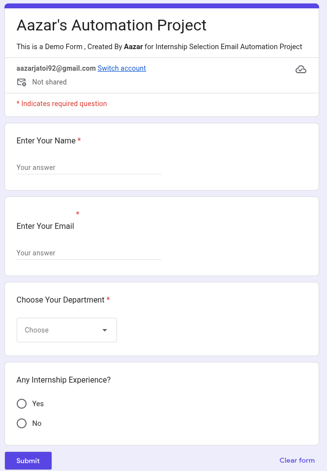
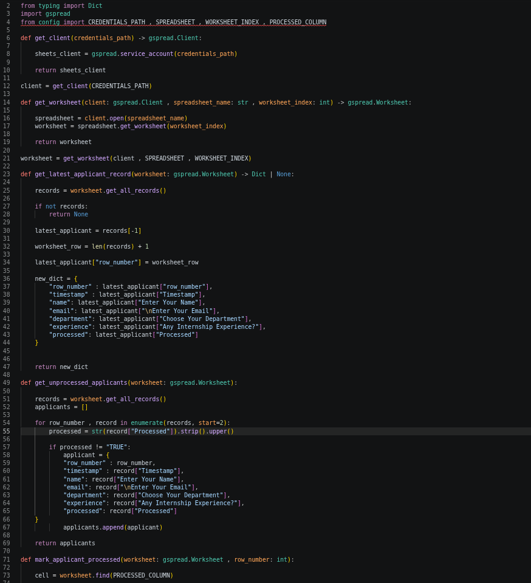
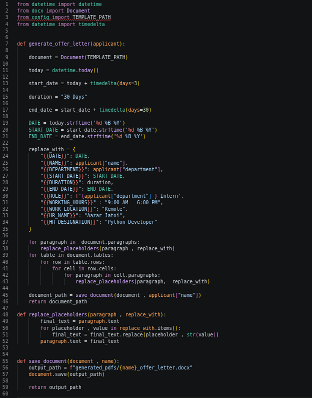
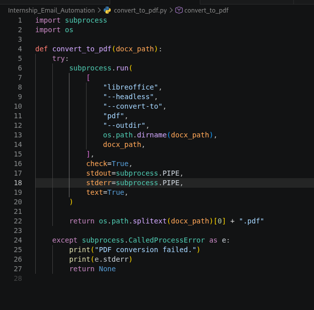
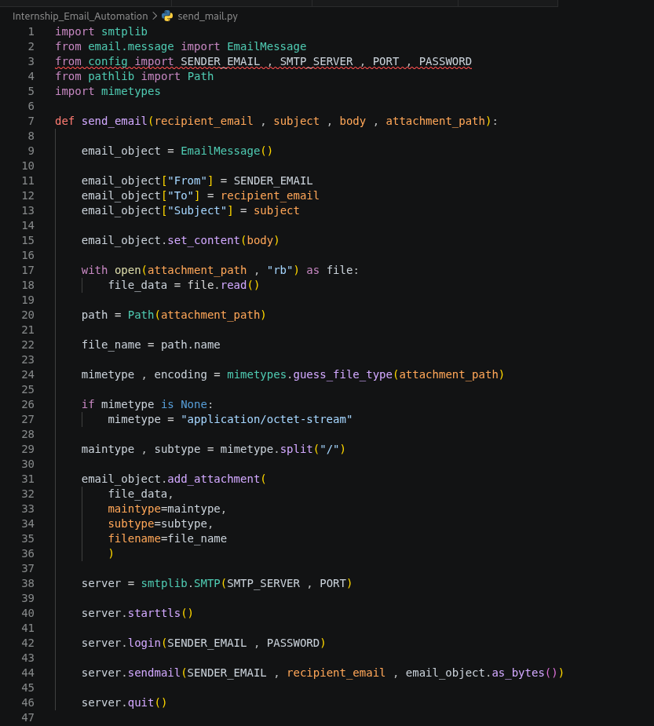
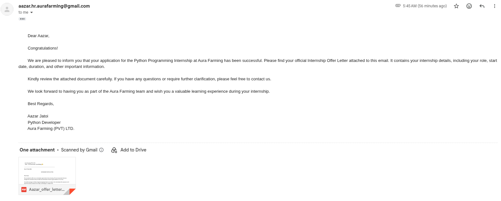

# 📄 Automated Internship Offer Letter System


An automated document generation and email delivery system built with **Python** that processes internship applications from **Google Forms**, generates personalized **Offer Letters**, converts them to **PDF**, emails them to applicants, and marks them as processed in **Google Sheets**.

---

## ✨ Features

- 📋 Reads applicant data from Google Sheets
- 📄 Generates personalized internship offer letters (.docx)
- 📑 Converts Word documents to PDF using LibreOffice
- 📧 Sends professional emails with PDF attachments
- ✅ Prevents duplicate emails using a Processed column
- 📂 Modular project structure
- 🐧 Works on Linux (Kali Linux Tested)

---

## 🛠 Tech Stack

- Python 3
- Google Sheets API (gspread)
- python-docx
- LibreOffice (Headless)
- SMTP (Gmail)
- MIME Email Attachments

---

## 📁 Project Structure

```
Internship_Email_Automation/
│
├── templates/
│   └── Aura_Farming_Internship_Offer_Template.docx
│
├── generated_pdfs/
├── logs/
│
├── main.py
├── google_sheets.py
├── generate_document.py
├── convert_to_pdf.py
├── send_mail.py
├── config.py
├── requirements.txt
└── README.md
```

---

## ⚙ Workflow

```
Google Form
      │
      ▼
Google Sheets
      │
      ▼
Read Unprocessed Applicants
      │
      ▼
Generate Offer Letter (.docx)
      │
      ▼
Convert to PDF
      │
      ▼
Send Email with Attachment
      │
      ▼
Mark Applicant as Processed
```

---

## 🚀 Installation

Clone the repository

```bash
git clone https://github.com/YOUR_USERNAME/Internship_Email_Automation.git
```

Move into the project

```bash
cd Internship_Email_Automation
```

Install dependencies

```bash
pip install -r requirements.txt
```

Install LibreOffice

```bash
sudo apt install libreoffice
```

Configure your Google Sheets credentials and email settings.

Run the project

```bash
python main.py
```
## Configuration

Before running the project:

1. Create a Google Cloud Service Account.
2. Download the service account JSON credentials.
3. Update `CREDENTIALS_PATH` in `config.py`.
4. Enter your Gmail address and App Password in `config.py`.
5. Share your Google Sheet with the service account email.

---

## 📸 Screenshots

# 📸 Project Demo

## 1. Google Form

Applicants submit their internship applications through a Google Form.



---

## 2. Google Sheets Integration

Application responses are automatically stored in Google Sheets, where the automation retrieves unprocessed applicants.



---

## 3. Offer Letter Generation

A personalized internship offer letter is generated by replacing placeholders in the template with the applicant's information.



---

## 4. PDF Conversion

The generated Word document is automatically converted into a professional PDF using LibreOffice in headless mode.



---

## 5. Email Automation

The generated PDF is attached and sent to the applicant via email using Gmail SMTP.



---

## 6. Email Received by Applicant

The applicant receives a professional internship offer email with the generated PDF attached.



---

## 🔒 Security

Sensitive files are excluded from version control.

- credentials.json
- .env
- generated PDFs
- Logs

---


---

## 👨‍💻 Author

**Aazar Jatoi**

Python Backend Developer

---

## ⭐ If you found this project useful, consider giving it a Star.